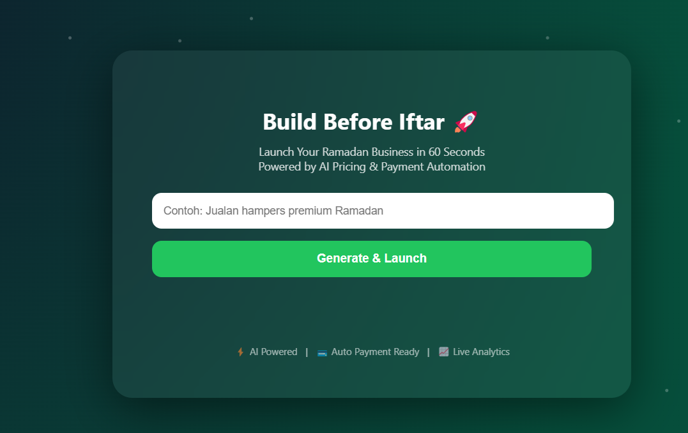

# 🚀 Ramadan AI Commerce  
### Build Before Iftar. Launch in 60 Seconds.

AI-powered commerce engine yang mengubah ide bisnis Ramadan menjadi produk siap jual lengkap dengan sistem pembayaran dan dashboard profit hanya dalam satu klik.

---

## 🎯 Problem Statement

Setiap Ramadan banyak orang memiliki ide jualan seperti:

- Hampers  
- Takjil  
- Baju Lebaran  
- Produk UMKM  
- Parcel & Gift Box  

Namun sering terhambat oleh:

- Tidak tahu menentukan harga optimal  
- Tidak memiliki sistem pembayaran online  
- Tidak punya pencatatan transaksi  
- Tidak bisa melihat profit secara real-time  
- Waktu terbatas menjelang Ramadan  

Akibatnya ide berhenti sebagai wacana.

---

## 💡 The Solution

**Ramadan AI Commerce** mengotomatisasi seluruh proses bisnis:

Idea → Product → Payment → Revenue → Analytics

Dalam ±60 detik pengguna bisa:

- Menghasilkan nama dan deskripsi produk menggunakan AI  
- Mendapatkan harga dengan margin otomatis  
- Membuat link pembayaran instan  
- Membagikan ke WhatsApp  
- Melihat profit dan pertumbuhan revenue di dashboard  

Bukan sekadar teknologi. Ini percepatan peluang.

---

## 🤖 AI Workflow
User Input Idea
↓
AI Generate Product + Base Price
↓
Auto Pricing Engine (+20% margin)
↓
Mayar API Create Payment Link
↓
WhatsApp Share
↓
Webhook Capture Payment
↓
Logging + Dashboard Analytics

---

## 🧠 System Architecture

### Frontend

- HTML5  
- CSS3  
- Animated loading steps  
- Success notification sound  
- WhatsApp share integration  

### Backend

- Node.js  
- Express  
- OpenAI API  
- Mayar Headless API  
- Secure webhook validation  
- Revenue & profit logging  

### Infrastructure

- Ubuntu VPS  
- PM2  
- Nginx  
- SSL  
- GitHub  

---

## 🌐 Live Demo

**App:**  
https://ramadan.masri.cloud  

**Dashboard:**  
https://ramadan.masri.cloud/dashboard  

## 🎥 Video Demo

---

## 📸 Screenshots

### 🏠 Home Interface

### 📊 Analytics Dashboard

---

## 🏆 Built for Vibecoding Competition 2026

Dikembangkan melalui pendekatan **vibecoding** dengan kolaborasi AI dan human system architecture untuk menghasilkan end-to-end commerce automation.
